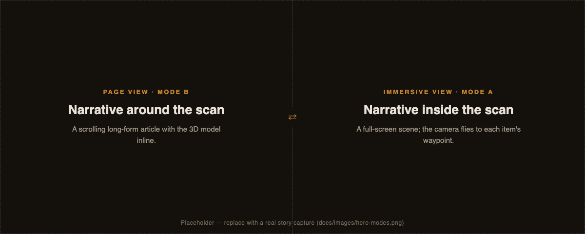
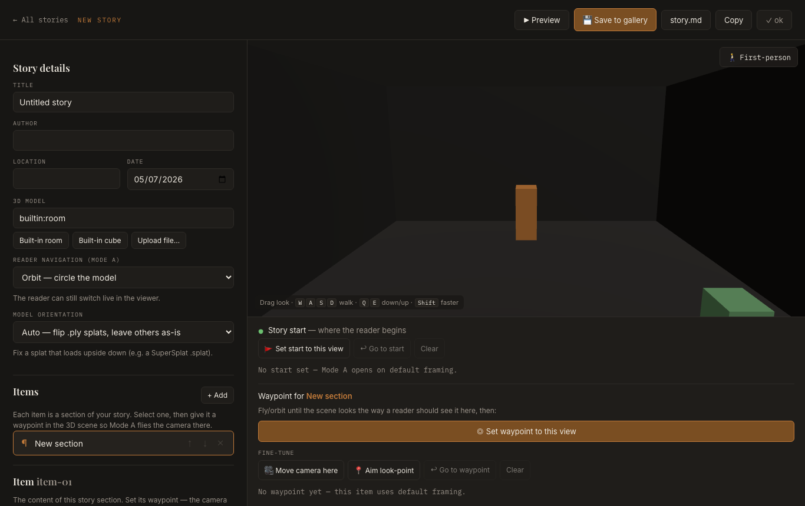

# Spatial Storytelling Engine

A local-first web engine for telling stories **inside** a 3D scan. One Markdown `story.md` file
drives two switchable presentation modes — no reload, no backend.

> The scan is shared infrastructure; the story is the act of authorship.

A 3D scan is expensive to make and cheap to reuse. Treating it as *infrastructure* rather than a
deliverable means one capture of a place can hold many accounts of it — the architect's, the
resident's, the journalist's — without any one overwriting the others.
[Why this exists →](./docs/VISION.md)



- **Page view (Mode B):** a scrolling long-form article; the 3D model is one inline element in
  the scroll. *Narrative around the scan.*
- **Immersive view (Mode A):** a full-screen 3D scene where advancing the story flies the camera
  to each section's bound waypoint and shows its content as an overlay. *Narrative inside the scan.*

Both modes read the **same** story file; a toggle switches between them live.

---

## Quick start

**Prerequisites:** Node.js 18+ and npm. (With `nvm`: `nvm use 20`.)

```bash
git clone https://github.com/WWStoryMode/Spatial-Storytelling-Engine
cd Spatial-Storytelling-Engine
npm install
npm run dev        # → http://localhost:5173
```

Open **http://localhost:5173/** — Home lists the bundled demo stories. Click **+ New story** to
open the editor.

Other scripts: `npm run build` (type-check + production bundle) · `npm run preview` (serve the
build) · `npm run test` (Vitest) · `npm run publish:site -- <slug>` (export one story as a
deploy-anywhere site).

## Create your first story

The fastest path is the in-app editor (**+ New story** on Home):



1. **Upload** your 3D scan — a `.glb` mesh or a `.sog`/`.ply`/`.splat`/`.ksplat`/`.spz` Gaussian
   splat.
   No scan yet? Capture one on a phone with [Scaniverse](https://scaniverse.com/) or Polycam.
2. Fill in the details and **add sections** (text / image / audio / video), uploading any media inline.
3. Frame the 3D scene and **add waypoints**, then point each section at one; hit **▶ Preview** to
   check both modes. (The first section's waypoint is the opening view.)
4. Click **💾 Save to gallery**, then from Home **select** stories and **⬇ Export** a
   self-contained website.

Already have an exported story? Click **⬆ Import story** on Home to reopen the `.zip` or folder in
the editor — it comes back upgraded to the current format.

📖 Full walkthrough + the `story.md` format → **[Authoring a story](./docs/AUTHORING.md)**.
Preparing a scan or a splat that loads upside down →
**[Gaussian splats & 3D models](./docs/GAUSSIAN-SPLATS.md)**. Hosting (and re-importing) the exported
site → **[Publishing & sharing](./docs/PUBLISHING.md)**.

## Documentation

| Guide | What's in it |
| --- | --- |
| [Why this exists](./docs/VISION.md) | The problem, who it is for, the principles, and how the engine relates to the wider platform idea. |
| [Authoring a story](./docs/AUTHORING.md) | The editor, hand-authoring, and the full `story.md` format reference. |
| [Gaussian splats & 3D models](./docs/GAUSSIAN-SPLATS.md) | Supported formats, SuperSplat prep, the orientation fix, and hosting. |
| [Publishing & sharing](./docs/PUBLISHING.md) | Export a story as a static site and host it (Netlify, Vercel, and more). |
| [Development](./docs/DEVELOPMENT.md) | Setup, scripts, tests, debug flags, and where things live. |
| [Engineering notes](./docs/ENGINEERING-NOTES.md) | Architecture decisions and hard-won findings — splat formats, frame pacing, renderer choice. |
| [Roadmap](./ROADMAP.md) | What is being worked on next. |

## Tech stack

- **React + Vite + TypeScript**, hash-routed and fully static.
- **One unified [Three.js](https://threejs.org/) viewer** for both GLB meshes and Gaussian
  splats, with [`camera-controls`](https://github.com/yomotsu/camera-controls) for
  hotspot-to-hotspot animation and
  [Spark](https://github.com/sparkjsdev/spark) for splats (lazy-loaded — only splat stories pay
  for it).
- **No backend** — story data and assets are plain files under `public/stories/`.

Architecture and rationale live in the [engineering notes](./docs/ENGINEERING-NOTES.md).

## Status

In active development and usable today: the full loop — import a scan, author a story with
waypoints and media, preview both modes, export a self-contained website — works end to end, and
stories have been published live.

Rough edges are honest ones: accessibility is unaudited, the immersive view was designed on desktop
and is workable rather than polished on phones, and the VR viewer is a generation behind the main
one. See the [roadmap](./ROADMAP.md).

## License

MIT — see [LICENSE](./LICENSE). Use it, fork it, build a product on it; no permission needed.

The bundled third-party dependencies keep their own licences, reproduced in
`public/THIRD-PARTY-NOTICES.txt` — generated from the dependency tree at build time (so it does not
exist on a fresh clone until you run `npm run dev` or `npm run build`) and included in every
published site.

Pull requests are not currently accepted — see [CONTRIBUTING.md](./CONTRIBUTING.md). Issues and
forks are welcome.
