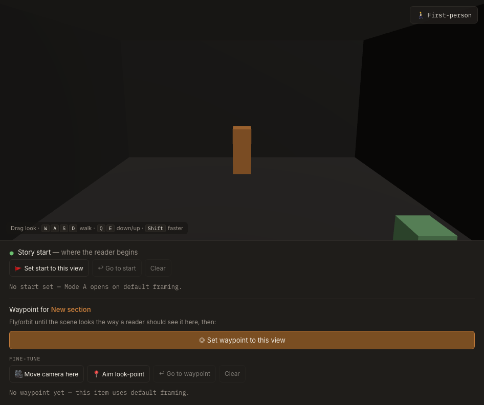

# Authoring a story

A story is a single Markdown file — `story.md` — plus its media files (a 3D model, images,
audio, video) in an `assets/` folder next to it. Nothing is locked in a database: a story is
plain files you can zip, move, and open anywhere.

There are two ways to write one:

- **[The in-app editor](#the-in-app-editor)** — the quickest path; no Markdown by hand.
- **[By hand](#authoring-by-hand)** — write `story.md` in your text editor and drop files in a
  folder.

Either way, the output is the same `story.md` + `assets/` bundle, and the
[format reference](#storymd-format-reference) below is the source of truth.

---

## The in-app editor

From the Home page click **+ New story**.


1. **Story details** — fill in the title, author, location, and date, then **Upload file…**
   your 3D model. A [Scaniverse](https://scaniverse.com/) export works well: `.glb` for a mesh,
   or `.ply` / `.splat` / `.ksplat` / `.spz` for a Gaussian splat. See
   [Gaussian splats & 3D models](./GAUSSIAN-SPLATS.md) for preparing scans.
2. **Add items** — each item is a beat in the story: **text**, **image**, **audio**, or
   **video**. Add as many as you like and **Upload file…** any media inline. Reorder them with
   the up/down controls.
3. **Set the views** — this is what makes it spatial:
   - **Story start** — the opening camera the reader sees first.
   - **Each item's waypoint** — where the camera flies to when that item is active in the
     immersive view. Position the camera in the 3D scene and capture it in one click.

   
4. **Preview** — hit **▶ Preview** to check both modes live: **Page view** (Mode B, the
   scrolling article) and **Immersive view** (Mode A, the full-screen scene).
5. **Reader navigation** (optional) — choose the immersive default: **Orbit** (circle the model)
   or **First-person** (look around and walk with WASD). Readers can still switch live.
6. **Model orientation** (optional) — if a splat loads upside down, set this to **Flip upright**.
   See [orientation](./GAUSSIAN-SPLATS.md#orientation).
7. **Save & publish** — click **💾 Save to gallery**; the story appears on the Home page. From
   the gallery, select stories and **⬇ Export** a self-contained website. Full steps:
   [Publishing & sharing](./PUBLISHING.md).

> The editor keeps stories **in memory for the session** — the exported zip is your durable
> copy. Save often, and export before closing the tab.

---

## Authoring by hand

Prefer your own text editor? A story is just a folder under `public/stories/`:

```
public/stories/my-story/
├─ story.md
└─ assets/
   ├─ scene.glb        # your 3D model
   ├─ photo.jpg        # any image / audio / video items reference
   └─ narration.mp3
```

1. Create the folder and drop your model + media into `assets/`.
2. Write `story.md` following the [format reference](#storymd-format-reference).
3. Register it in `public/stories/index.json` so it shows on the Home page:
   ```json
   {
     "stories": [
       {
         "id": "my-story",
         "title": "My Story",
         "author": "You",
         "location": "Somewhere",
         "date": "2026-07-05",
         "path": "stories/my-story/story.md"
       }
     ]
   }
   ```
4. Run `npm run dev` and open the story from Home.

---

## `story.md` format reference

A story file is **YAML frontmatter** (between `---` lines) followed by a sequence of **item
blocks** separated by `---`.

### Frontmatter

```yaml
---
title: "The Old Print Works"
author: "Demo Author"
location: "Cradley Heath, England"
date: "2026-06-01"
model: "assets/scene.glb"     # or builtin:room for a placeholder
navigation: "orbit"           # optional — "orbit" (default) or "firstPerson"
orientation: "flip"           # optional — "flip" or "none" (see splats doc)
start:                        # optional — the opening camera
  position: [0.5, 1.2, -2.1]
  target: [0, 1, 0]
---
```

| Field | Required | Notes |
| --- | --- | --- |
| `title` / `author` / `location` / `date` | yes | Shown on Home and in the story header. |
| `model` | yes | Path to the 3D model (relative to the story folder), or `builtin:room` for a generated placeholder. Formats: `.glb`/`.gltf`, `.ply`/`.splat`/`.ksplat`/`.spz`. |
| `navigation` | no | Reader's default immersive camera: `orbit` or `firstPerson`. Absent = orbit. |
| `orientation` | no | Splat up-axis override: `flip` (force upright) or `none` (no correction). Absent = auto. See [Gaussian splats](./GAUSSIAN-SPLATS.md#orientation). |
| `start` | no | Opening camera (`position` + `target` in world coordinates). Absent = auto-framed from the model bounds. |

### Item blocks

Each item is a heading `## [item-id] Title`, then a `type:` line, optional `src:` / `caption:`,
freeform body text, and an optional `hotspot:` (the camera waypoint for the immersive view).

```markdown
## [item-02] The composing room

type: image
src: assets/entrance.svg
caption: "The composing room, photographed in 1987."

Upstairs, the composing room is where type was set by hand, letter by letter.

hotspot:
  position: [2.1, 0.8, 1.4]
  target: [0, 0.5, 0]
```

| Part | Required | Notes |
| --- | --- | --- |
| `## [id] Title` | yes | A stable `id` (e.g. `item-02`) and a display title. |
| `type` | yes | `text`, `image`, `audio`, or `video`. |
| `src` | for media | Path to the asset, relative to the story folder (e.g. `assets/photo.jpg`). |
| `caption` | no | Caption shown under the media. |
| body | no | Freeform Markdown/plain text. |
| `hotspot` | no | Camera `position` + `target` the immersive view flies to. Items without one fall back to default framing. |

Coordinates are Cartesian world-space `[x, y, z]`. Getting them right by hand is fiddly —
the editor's click-to-place is easier.

> **Non-fatal warnings.** The parser never throws on a malformed field; it collects warnings
> (e.g. an unknown `navigation` value, a bad hotspot) and surfaces them rather than dropping the
> whole story. A story with warnings still loads.

The TypeScript source of truth for these shapes is
[`src/parser/types.ts`](../src/parser/types.ts).

---

## Next steps

- **Prepare a 3D scan / fix orientation** → [Gaussian splats & 3D models](./GAUSSIAN-SPLATS.md)
- **Publish as a website** → [Publishing & sharing](./PUBLISHING.md)
