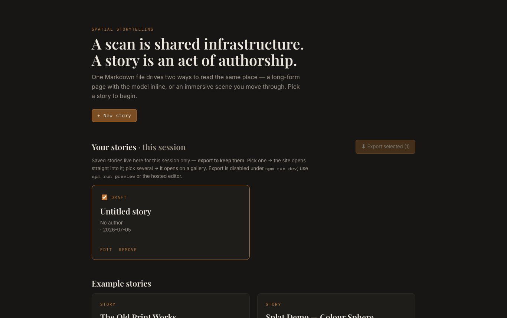

# Publishing & sharing a story

A published story is a **complete, self-contained website**: one folder you can drop on any
static host, with no backend, no build step on the host, and no special server configuration.
Everything is local-first: no account, no upload to us — you stay in control of the files, which
stay as plain `story.md` + assets you can zip and reuse anywhere. And because the export *is* those
plain files, you can [reopen it in the editor](#editing-an-exported-story-again) later to keep working.

There are two ways to produce that website, for two situations:

| You are… | Use | Needs a terminal? |
| --- | --- | --- |
| Authoring in the editor (built or hosted app) | **💾 Save to gallery → Export** | No |
| Working in the repo / running `npm run dev` | **`npm run publish:site -- <slug>`** | Yes |

---

## A. Save to gallery → Export — no terminal (recommended)

The editor doesn't publish directly; it **saves to a gallery**, and you export from there. This
lets you build several stories and ship them together.



1. **Author** your story in the editor, then click **💾 Save to gallery**. You land on the Home
   **gallery**, where the story now appears under **"Your stories"**.
2. Repeat for as many stories as you like — each **Save** adds one to the gallery. (Editing a
   saved story and saving again updates it in place.)
3. On the gallery, **tick the stories you want** and click **⬇ Export selected**. You get a
   deployable zip:
   ```
   <site>/       ← the website (this is what you deploy)
   DEPLOY.md     ← a short copy of the hosting steps below
   ```
4. Unzip it and [put it online](#putting-it-online). No copying into the repo, no editing
   `index.json`, no separate build step.

**Selection decides the landing page:**
- **One** story selected → the site opens **straight into that story** (a "kiosk"); the zip
  folder is `<slug>-site`.
- **Several** selected → the site opens on the **gallery view** listing them (readers pick one);
  the zip folder is `gallery-site`.

> **Session-only — export is your save.** The gallery lives in your browser tab for this session
> only; a reload clears it. That's intentional: the **exported zip is the durable copy** (your
> portable `story.md` + files), so nothing is trapped in a hidden browser store. Export before you
> close the tab. (Durable, cross-session libraries come later, with accounts.)

> **Needs the built app.** Export assembles the site in your browser from the running app, so it
> works from a **hosted deployment of the editor** or a local production preview
> (`npm run build && npm run preview`). It is **disabled under `npm run dev`** — use
> [option B](#b-publish-from-the-repo) there. (Saving to the gallery works in dev; only Export needs
> the build.)

> **Tip — host the editor once.** Deploy this whole app as a static site (it's the same kind of
> static bundle a published story is). Authors then open that live editor, write stories, and
> export — no repo, no Node, no CLI.

> Uploaded media/models are packaged automatically under `assets/`. Media referenced by a
> **typed path** (not uploaded through the editor) is *not* included — upload it in the editor so
> it ships with the site. A static host can't save files back for you, so the export always
> downloads to *your* machine.

---

## B. Publish from the repo — `npm run publish:site`

For stories that live in the repo (`public/stories/<slug>/`: a `story.md` + its `assets/`),
or when you're authoring under `npm run dev`. From the project root (Node 18+):

```bash
npm run publish:site -- <slug>
```

> `<slug>` is the folder name under `public/stories/` — e.g. `tak-shun-mall`.

This builds the app, trims it to just that one story, injects the kiosk redirect, and writes
the same **`<slug>-site.zip`** (the deployable `<slug>-site/` folder + `DEPLOY.md`) to the
project root. The story doesn't need to be registered in `index.json` first — the script reads
its `story.md` frontmatter if there's no index entry. The zip is git-ignored (`*-site.zip`), so
exported sites never get committed.

---

## Putting it online

Pick any host. The same folder works on all of them.

### Netlify — easiest, drag & drop (no account-side config)

1. Unzip `<slug>-site.zip`.
2. Go to **<https://app.netlify.com/drop>**.
3. Drag the **`<slug>-site`** folder onto the page.
4. Netlify gives you a live URL immediately (e.g. `https://calm-otter-1234.netlify.app`).
   Optionally rename the site or attach a custom domain in **Site settings → Domain**.

### Vercel — drag & drop (Vercel Drop)

Like Netlify Drop, but on Vercel — no CLI, no Git:

1. Unzip `<slug>-site.zip` (or keep the whole `<slug>-site/` folder zipped).
2. Go to **<https://vercel.com/drop>**.
3. Drag the **`<slug>-site`** folder (or its `.zip`) onto the page, pick a team and project
   name, and select **Deploy**. Vercel publishes it straight to a production URL.
4. If it asks for a **Root** page (the site already has `index.html`, so it usually won't),
   choose `index.html`.

> Each drop creates a **new** project and isn't connected to Git, so it won't auto-redeploy —
> re-drop to update, or connect a repo afterward. Great for quick demos and one-off sites.

### Vercel — CLI

1. Unzip the file, then from inside the site folder:
   ```bash
   cd <slug>-site
   npx vercel deploy --prod
   ```
2. The first run opens a browser to log in, then asks a few setup questions (scope, project
   name) — accept the defaults; when asked for the directory to deploy, use the current one
   (`./`). It prints a production URL when done.
3. Re-deploy later by re-running the same command.

### Cloudflare Pages / Surge / Render / any static host

Upload the **contents of `<slug>-site/`** as a static site. For example, with
[Surge](https://surge.sh): `cd <slug>-site && npx surge`.

### GitHub Pages, S3, nginx, or your own site's subfolder

Copy the **contents of `<slug>-site/`** to any path — including a **subfolder** of an
existing site (e.g. `https://example.com/news/spatial/`). No rebuild needed: the site uses
relative paths and hash-based routing, so it resolves wherever it lives.
- **GitHub Pages:** commit the folder's contents to your Pages branch/dir; the project-site
  subpath (`username.github.io/repo/`) works as-is.
- **nginx / Apache / S3:** just serve the files statically. No rewrite rules required.

---

## Editing an exported story again

An export isn't a dead end — it's your source. To make changes later, bring it back into the editor:

1. On the Home page, click **⬆ Import story**.
2. Drop the exported **`.zip`**, or the unzipped **`<slug>-site`** folder, onto the dialog (or pick
   it with the file/folder buttons).
3. The story reappears under **"Your stories"** with its scan and media — **upgraded to the current
   story format** (an old export made before a feature existed comes back ready to use it). Edit,
   **▶ Preview**, and **⬇ Export** again as usual.

This closes the loop: **author → export → deploy → import → edit → re-export**, all local-first, with
the plain `story.md` + `assets/` as the thing that travels. (You can also re-import someone else's
exported site the same way, since it's just those same plain files.)

---

## Hosting checklist & troubleshooting

- **Use a trailing slash on subfolders.** Open `…/news/spatial/`, **not** `…/news/spatial`.
  Most hosts add it automatically; if the page is blank on a subfolder, check this first.
- **Blank page or 404s for `stories/index.json` / `story.md` / `assets/…`** → almost always
  the trailing-slash issue above, or the folder contents weren't uploaded at the path you're
  visiting. The data is fetched *relative* to the page URL.
- **Splat doesn't render** → splats need no special headers here, but the model file
  (`assets/scene.ksplat` etc.) must have been uploaded through the editor (or present under
  `public/stories/<slug>/assets/` at CLI-export time). Re-export after confirming it's there.
  Large splats can take a few seconds; a loading indicator shows while it streams.
- **Fonts look different offline** → the page pulls web fonts from Google Fonts and falls
  back to system fonts without a connection. Cosmetic only.
- **URLs have a `#`** (e.g. `…/#/story/<slug>`) → expected. Hash routing is what lets the
  same files run at any path with no server config.
- **Very large scans** → **Export** zips in the browser, so a multi-hundred-MB splat (more so a
  multi-story export) can be memory-heavy; if it struggles, export fewer at once or use the CLI
  ([option B](#b-publish-from-the-repo)).

---

## How it works (for the curious)

- **One shared shape**: a published site = the generic app shell (identical for every story of
  an app version) + one or more stories' data + a `DEPLOY.md`, with a kiosk redirect **only** for
  a single-story export. **Export** fetches the running app's shell (listed in
  `publish-manifest.json`, emitted at build time) and re-zips it with the selected stories — no
  rebuild. `publish:site` does the same assembly from a fresh build. Both share
  `src/publish/siteTemplate.mjs`, so they can't drift.
- **Hash routing** (`HashRouter`): the browser only ever loads `index.html`; the route lives
  after the `#`. So there's no server-side SPA-fallback to configure, and the document's base
  URL is stable wherever the folder sits.
- **Relative data paths**: the app fetches `stories/index.json` (not `/stories/…`) and asset
  paths resolve against the page, so everything works at a root or a subfolder.
- **No COOP/COEP headers**: the Gaussian-splat renderer runs without `SharedArrayBuffer`
  (`sharedMemoryForWorkers: false`), so plain static hosts work — no cross-origin isolation
  setup.
- **Kiosk redirect** (single-story exports only): a tiny injected script sends the deployed root
  straight to `#/story/<slug>`. A multi-story export omits it, so the site opens on the gallery.

See [`DEVLOG.md`](./DEVLOG.md) → *M9*–*M11* for the full rationale.
